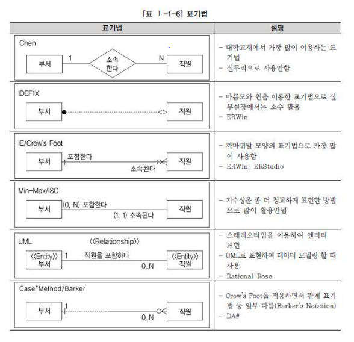

# 1. 데이터 모델링의 이해

## 1.1 데이터 모델의 이해

- 모델링이란?
```
복잡한 현실세게를 일정한 표기법에 의해 표현하는 일
```

- 모델링을 세가지 특징으로 요약하면 다음과 같다.
```
추상화 : 현실세계를 일정한 양식인 표기법에 의해 표현한다는 것

단순화 : 복잡한 현실세계를 제한된 표기법이나 언어로 표현하므로 쉽게 이해할 수 있음

명확화 : 애매모호함을 제거하고 정확하게 현상을 기술하는 것
```

- 모델링의 세 가지 관점
```
데이터 관점 : 대상이 어떤 데이터와 관련이 있는지 또는 데이터간의 관계는 무엇인지에 대해서 모델링하는 방법

프로세스 관점 : 대상이 무엇을 해야 하는지를 모델링하는 방법

데이터와 프로세스의 상관관점 : 대상이 처리하는 일의 방법에 따라 데이터가 어떻게 영향을 받고 있는지 모델링하는 방법

데이터 모델링에서는 데이터 관점을 중심으로 설명한다.
```

## 1.2 데이터 모델의 기본 개념의 이해 (모델링의 개념을 기준으로 이해해보기)

- 데이터 모델링이란?
```
현실세계의 데이터에 대해 약속된 표기법에 의해 표현하는 과정
```

- 데이터 모델링의 중요성
```
데이터 모델링의 중요성은 모델링의 세가지 특징과 맞물린다.

파급효과 (추상화) : 잘 추상화 된 데이터를 시스템 구축에 이용해야 대규모의 데이터 이행을 성공적으로 수행할 수 있다. 중간에 데이터의 구조를 변경해야 하는 경우 프로젝트의 큰 위험요소가 아닐 수 없다.

복잡한 정보 요구사항의 간결한 표현 (단순화) : 데이터 모델은 정보 요구사항을 명확하고 간결하게 표현할 수 있어야 한다.

데이터 품질 (명확화) : 데이터는 기간이 오래 될 수록 활용가치가 높아진다. 시간이 지나도 활용할 수 있고 비즈니스 정의에 부합하는 실용성있는 데이터가 되어야 한다. 이를 위해서는 요구사항을 잘 정의하며 이를 명확하게 데이터의 구조를 설계하여야 한다.
```

- 데이터 모델링의 유의점
```
중복 : 데이터 모델은 시간, 사람, 장소 등 다양한 요인이 다른 환경에서 사용한다. 사용하는 사람이 다른 환경에서 같은 정보를 저장하는 잘못을 하지 않도록 중복을 방지해주어야 한다.

유연성 : 데이터 모델을 어떻게 설계하느냐에 따라 데이터 모델이 수시로 변경될 수 있으며 유지보수에 어려움을 줄 수 있다. 데이터 정의를 사용 프로세스와 분리 시키면서 데이터베이스의 변화가 어플리케이션에 중대한 변화를 일으킬 수 있는 가능성을 줄인다.

일관성 : 데이터 모델링을 할 때 데이터와 데이터간의 상호 연관 관게에 대한 명확한 정의를 하여 데이터가 다른 데이터와 모순되지 않도록 방지해주어야 한다.
```

## 1.3 데이터 모델링의 3단계 진행

- 데이터베이스가 만들어지는 과정

```
데이터 베이스가 만들어지는 과정은 시간에 따라 개념적 데이터 모델, 논리적 데이터 모델, 물리적 데이터 모델로 정리할 수 있다.

개념적 데이터 모델링: 추상화 수준이 높고 업무중심적이고 포괄적인 수준의 모델링 진행. 전사적 데이터 모델링. EA (enterprise architecture)수립시 많이 이용

논리적 데이터 모델링: 시스템으로 구축하고자 하는 업무에 대해 Key, 속성, 관계 등을 정확하게 표현, 재사용성이 높음

물리적 데이터 모델링: 실제러 데이터베이스에 이식할 수 있도록 성능, 저장 등 물리적인 성격을 고려하여 설계
```

- 개념적 데이터 모델링
```
조직, 사용자의 데이터 요구사항을 찾고 분석하는데서 시작된다.
이 단계에서 주요한 활동은 핵심 엔터티와 그들 간의 관계를 발견하고 그것을 엔터티-관계 다이어그램을 생성하는 것이다. 데이터 모델링 과정이 전 조직에 걸쳐 이루어진다면, 그것은 전사적 데이터 모델이라고 불린다.
```

- 논리적 데이터 모델링
```
논리적 데이터 모델링의 핵심은 비즈니스 데이터에 존재하는 사실들을 인식하여 기록하는 것이다. 시스템 구축을 위하여 인간이 결정해야 할 대부분의 사항을 모두 정의하한다. 또한 정규화를 진행한다. (정규화란 논리 테이터 모델의 일관성을 확보하고 중복을 제거하여 속성들이 가장 적절한 엔터티에 배치되도록 하는 작업)
```

- 물리적 데이터 모델링
```
논리 데이터 모델이 데이터 저장소로서 어떻게 하드웨어에 표현될 것인가를 다룬다. 데이터가 컴퓨터에 어떻게 저장될 것인가에 대한 정의를 물리적 스키마라고 한다. 이 단계에서 결정 되는 것은 테이블, 칼럼 등으로 표현되는 물리적인 저장구조와 사용될 저장 장치, 자료를 추출하기 이해 사용될 접근 방법 등이 있다.
```

## 1.4 프로젝트 생명주기에서 테이터 모델링

프로젝트 생명주기는 소프트웨어 공학에 나오는 개념으로 하나의 프로젝트를 어떻게 효율적으로 개발할 것인가에 대한 내용과 관련된다. 자세한 내용은 소프트웨어 공학 참고...

```
프로젝트 라이프 사이클에서의 데이터 모델링 과정은 다음과 같이 대응된다.

분석 : 논리, 개념 데이터 모델링

설계 : 물리 데이터 모델링

개발 : DB 구축, 변경, 관리

테스트 : DB 튜닝

전황 / 이행 (유지보수) : DB 전환

객체 지향 개념은 데이터와 프로세스를 한번에 바라보며 모델링을 전개하므로 데이터 모델링과 프로세스 모델링을 구분하지 않고 일체형으로 진행하곤 한다. (데이터 : 속성, 프로세스 : 메소드 가 같이있는 클래스가 이에 해당한다)
```

## 1.5 데이터 모델링에서 데이터 독립성의 이해

데이터 독립성을 데이터 모델링의 유의점인 중복, 유연성, 일관성과 관련지어 이해해보자.

- 데이터 독립성의 필요성
```
데이터 독립성을 이해하기 위해서는, 데이터 독립성이라고 하는 개념이 출연하게 된 배경을 이해할 필요가 있다.

데이터 독립성은 지속적으로 증가하는 유지보수 비용을 절감하고 데이터 복잡도를 낮추며 중복된 데이터를 줄이기 위한 목적이 있다. 또한 끊임없이 요구되는 사용자 요구사항에 대해 화면과 데이터베이스 간에 서로 독립성을 유지하기 위한 목적으로 데이터 독립성 개념이 출연했다고 할 수 있다.

데이터 독립성은 ANSI (미국 표준 협회) 산하의 X3 위원회의 DBMS와 그 인터페이스를 위해 제안한 'three-schema-architecture'로 정의할 수 있다.

데이터 독립성을 확보하게 되면 다음과 같은 효과를 얻을 수 있다. 각 View의 독립성을 유지하고 계층별 View에 영향을 주지 않고 변경이 가능하다. 또한 단계별 Schema에 따라 데이터 정의어(DDL)와 데이터 조작어(DML)가 다름을 제공한다.
```

- 데이터 베이스 3단계 구조 (개념적, 논리적, 물리적 모델링 과정과 맞물린다)
```
3단계 구성의 독립성 모델은 외부단계, 개념적 단계, 내부적 단계로 구성된 서로 간섭되지 않는 모델을 제시하고 있다.

외부 단계 : 사용자가 보는 개인적 DB 스키마, 개개 사용자나 응용프로그래머가 접근하는 DB 정의 (사용자 관점 접근하는 특성에 따른 스키마 구성)

개념 스키마 : 모든 응용시스템들이나 사용자들이 필요로 하는 데이터를 통합한 조직 전체의 DB를 기술한 것으로 DB에 저장되는 데이터와 그들간의 관계를 표현하는 스키마 (통합관점)

내부 스키마 : 물리적 장치에서 데이터가 실제적으로 저장되는 방법을 표현하는 스키마 (물리적 저장구조)
```

- 두 영역의 데이터 독립성
```
3단계로 개념이 분리되면서 각각의 영역의 독립성을 지정하는 용어가 논리적 독립성과 물리적 독립성이다.

논리적 독립성 : 개념 스키마가 변경되어도 외부 스키마에는 영향을 미치지 않도록 지원하는 것

물리적 독립성 : 내부 스키마가 변경되어도 외부/개념 스키마는 영향을 받지 않도록 지원하는 것
```

- 사상 (Mapping)
```
사상이라는 번역어보다는 Mapping으로 기억하는게 나을 것 같다. Mapping은 상호 독립적인 개념을 연결시켜주는 다리를 뜻한다.

외부적/개념적 Mapping : 외부적 뷰와/개념적 뷰의 상호 관련성을 정의함

개념적/내부적 Mapping : 개념적 뷰와/저장된 데이터베이스의 상호 관련성을 정의한다.
```

## 1.6 데이터 모델링의 중요한 세 가지 개념
```
다음 세 가지 개념은 데이터 모델에 대한 이해의 근간이 되는 개념이므로 기억 할 필요가 있다.
```

- 데이터 모델링의 세 가지 요소
```
1) 업무과 관여하는 어떤 것 (Things) - 엔터티

2) 어떤 것이 가지는 성격 (Attributes) - 속성

3) 업무과 관여하는 어떤 것 간의 관계 (Relationships) - 관계

세상의 있는 사람, 사물, 개념 과 같은 정보들은 어떤 것 간의 관계, 성격의 구분을 통해 분류할 수 있다. 이러한 원리를 이용하여 정보들을 세 가지 관점의 접근 방법을 통해 접근하여 모델링을 진행하는 것이다.
```

- 단수와 복수 명명
```
데이터 모델링에서는 이 세 가지 개념에 대해서 단수와 복수의 개념을 분명하게 구분하고 있다.

어떤 것 : 복수 (엔터티 Entity), 개별 요소 (인스턴스 Instance)

어떤 것 간의 연관성 : 복수 (관계 Relationship), 개별 요소 (패어링 Paring)

어떤 것의 성격 : 복수 (속성 Attribute), 개별 요소 (속성값 Attribute Value)
```

## 1.7 데이터 모델링의 이해 관계자

- 이해관계자의 데이터 모델링 중요성 인식
```
실제 업무 시스템을 구축하는 실전 프로젝트에서는 데이터베이스를 전문적으로 하는 DBA(Data Base Administrator)가 데이터 모델링을 전적으로 하는 예는 거의 없다.

데이터 베이스를 설계한다는 것은 데이터를 이해하고 분석하여 표현하는 것이 중요하고, 대부분 많은 시간을 업무를 분석하고 설계하는데 할애하기 때문에 대부분 업무 영역별 개발팀에서 데이터 모델링을 진행하는 것이다.

이에 따라 DBA는 정확하게 모델링이 진행 될 수 있도록 교육하고 제시하며 현안별로 직접 모델링을 진행하는 역할을 수행한다. 또한 개발을 진행하는 동안 데이터 구축의 중요성을 적절하게 알려주어야 한다. (업무가 적절하게 추상화 될 수 있도록 서포팅 하는 역할)
```

- 데이터 모델링의 이해 관계자
```
정보시스템을 구축하는 모든 사람 (전문적으로 코딩하는 사람)

프로젝트에 참여한 모든 IT 기술자들은 데이터 모델링에 대해 정확하게 알고 있어야 한다.

IT기술에 종사하거나 전공하지 않았더라도 업무에서 정보화 (추상화)를 추진하는 위치에 있는 사람 또한 어느정도 데이터 모델링에 대한 개념 및 세부사항에 대해 지식을 갖고 있어야 한다.

그래야만 서로가 업무를 잘못 해석하여 잘못된 시스템을 구축하는 위험을 줄일 수 있다.
```

## 1.8 데이터 모델의 표기법인 ERD의 이해

- 데이터 모델 표기법
```
1976년 피터첸이 Entity-relationship-model (E-R Model)이라는 표기법을 만들었다.

우리나라 대학에서는 주로 이 Chen의 모델 표기법을 통해 배우고 있다.
```

까마귀발 모양의 표기법이 실무에서는 제일 많이 사용된다.

- ERD(Entity Relationship Diagram) 표기법을 이용하여 모델링하는 방법
```
ERD는 엔터티와 엔터티간의 관계를 이해하기 쉽게 도식화한 다이어그램으로 표시하는 방법으로 실제 프로젝트에서는 데이터의 흐름과 프로세스와의 연관성을 이야기하는 데 가장 중요한 표기법이자 산출물이다.

정보공학을 기반으로 하는 모델링에서는 가장 적절한 ERD를 그려내는 것이 프로젝트의 지상과제이다. (소프트웨어 공학에서는 UML을 그려내는 것이 지상과제에 해당한다.)
```

- ERD 작업순서


```
엔터티 배치 : 가장 중요한 엔터티를 왼쪽 상단에 배치하고 이것을 중심으로 다른 엔터티를 우측으로 나열한다.

ERD 관계의 연결 : 관계를 정의한 분석서를 보고 서로 관련있는 엔터티 간의 관계를 설정하도록 한다. 중복되는 관계가 발생되지 않도록 하고 Circle 관계도 발생하지 않도록 유의하여 작성하도록 한다.

ERD 관계명의 표시 : 관계 설정이 완료되면 관계의 관계이름을 부여하도록 한다. 관계이름은 형재형을 사용하고 포괄적인 용어는 사용하지 않도록 한다.

ERD 관계 관계차수와 선택성 표시 : 관계에 대한 이름을 모두 지정하였으면 관계가 참여하는 성격 중 엔터티 내에 인스턴스들이 얼마나 관계에 참여하는 지를 나타내는 관계차수를 표현한다. 까마귀발 표기법 혹은 Barker 표기법 등을 사용한다.
```

## 1.9 좋은 데이터 모델의 요소

```
일반적으로 데이터 모델은 그 품질을 평가하는 것이 매우 어렵다. 업무 환경에서 요구하는 사항을 얼마나 잘 시스템적으로 구현할 수 있는가를 객관적으로 평가할 수 없기 떄문에 좋은 데이터라고 말할 수 있는 몇 가지의 요소들을 설명한다.

완전성 (Completeness) : 업무에서 필요로 하는 모든 데이터가 데이터 모델에 정의되어 있어야 한다.

중복 배제 (Non-Redundancy): 하나의 데이터베이스 내에 동일한 사실은 반드시 한 번만 기록하여야 한다.

업무 규칙 (Business Rules): 데이터 모델링 과정에서 도출되고 규명되는 수많은 업무 규칙을 데이터 모델에 표현하고 이를 활용하는 모든 사용자가 공유할 수 있도록 제공하는 것이다.

데이터 재사용 (Data Reussability) : 데이터 재사용성을 향상시키고자 한다면 데이터 통합성과 독립성에 대해서 충분히 고료해야 한다.
(본 교재에 이부분이 상당히 장황하게 설명되어 있음... 그만큼 중요한 듯) 

의사소통 (Communication) : 데이터의 중요한 역할 중 하나는 의사소통의 역할이다. 

통합성 (Integration) : 가장 바람직한 데이터 구조의 형태는 동일한 데이터는 조직의 전체에서 한번 만 정의되고 이를 여러 다른 영역에서 참조, 활용하는 것이다. 이를 위해 공유 데이터에 대한 구조를 여러 업무 영역에서 공동으로 사용하기 용이하게 정의할 수 있어야 한다. (데이터 재사용의 내용과 어느정도 중복됨)
```

