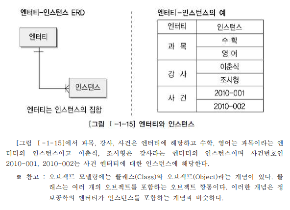

# 2. 엔터티(Entity)

## 2.1 엔터티의 개념

```
엔터티란 업무에 필요하고 유용한 정보를 저장하고 관리하기 위한 집합적인 것이다.

엔터티는 대상들 간에 동질성을 지닌 인스턴스들이나 그들이 행하는 행위의 집합으로 정의할 수 있다.

엔터티는 집합에 속하는 개체들의 특성을 설명할 수 있는 속성을 갖는데, 예를 들면
학생 이라는 엔터티는 학번, 이름, 이수학점 등의 속성을 갖는다.
```

## 2.2 엔터티와 인스턴스에 대한 내용과 표기법

엔터티와 엔터티간의 ERD를 그리면 다음과 같이 표현할 수 있다.


## 2.3 엔터티의 특징
```
엔터티가 다음의 성질을 만족하지 못하면 적절하지 않은 엔터티일 확률이 높다.

1. 반드시 해당 업무에서 필요한 정보이어야 한다.

2. 유일한 식별자에 의해 식별이 가능해야 한다.

3. 영속적으로 존재하는 인스턴스의 집합이어야 한다. (두개 이상)

4. 반드시 한개 이상의 속성이 있어야 한다.

5. 다른 엔터티와 최소 한 개 이상의 관계가 있어야 한다.
```

## 2.4 엔터티의 분류

엔터티는 유무형 혹은 발생시점에 따라 분류할 수 있다.

- 유무형에 따른 분류
```
유형 엔터티 : 물리적인 형태가 있고 안정적이며 지속적으로 활용되는 엔터티 (사원, 물품, 강사)

개념 엔터티 : 물리적인 형태는 존재하지 않고 관리해야 할 개념적 정보 (조직, 보험상품)

사건 엔터티 : 업무를 수행함에 따라 발생되는 엔터티 (주문, 청구, 미납)
```

- 발생시점에 따른 분류
```
기본 엔터티 : 타 엔터티의 부모의 역할을 하는 엔터티, 다른 엔터티와 관계에 의해 생성되지 않고 독립적으로 생성이 가능 (사원, 부서)

중심 엔터티 : 기본 엔터티로부터 발생되고 업무에 있어서 중심적인 역할을 하는 엔터티 (접수, 계약)

행위 엔터티 : 두 개 이상의 부모 엔터티로부터 발생되는 엔터티 (주문내역, 계약진행)
```

## 2.5 엔터티의 명명
```
1. 가능하면 현업 업무에서 사용하는 용어를 사용한다.

2. 약어를 사용하지 않는다.

3. 단수명사를 사용한다,

4. 모든 엔터티에서 유일하게 이름이 부여되어야 한다.

5. 엔터티 생성 의미대로 이름을 부여한다.

커뮤니케이션에 혼동을 주지 않는 것이 핵심이다.
```

