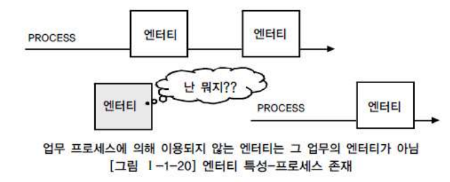

형식은 자유롭게 작성하시고, 템플릿 활용시 cp ./Template.md ./sulog.md 와 같이 복사해서 사용해주세요. 

# Subject : UnderStanding of Data Modeling

Contents
---

[Chapter 1. 데이터 모델의 이해](#데이터-모델의-이해)
1. [데이터 모델의 이해](#데이터-모델의-이해)
2. [엔티티](#엔티티)
3. [속성](#속성)
4. [관계](#관계)
5. [식별자](#식별자)

 [Chapter 2. 데이터 모델과 성능](#데이터-모델과-성능)

1. [성능 데이터 모델링의 개요](#성능-데이터-모델링의-개요)
2. [정규화와 성능](#정규화와-성능)
3. [반정규화와 성능](#반정규화와-성능)
4. [대량 데이터에 따른 성능](#대량-데이터에-따른-성능)
5. [데이터베이스 구조와 성능](#데이터베이스-구조와-성능)
6. [분산 데이터베이스와 성능](#분산-데이터베이스와-성능)

 

---
 

## 데이터 모델의 이해
 

### 데이터 모델의 이해

 
1. 데이터 모델링 정의

    현실 세계를 데이터베이스에서 표현하기 위한 **추상화 과정**이다.
    **데이터 모델링 표기법**을 사용하여 모델링한다.
    업무 프로세스 내 비즈니스 프로세스 규칙(BR)을 정의, 간결하게 데이터 모델로 표현.

_기능_ 

_시스템 가시화, 시스템 구조와 행동을 명세화, 시스템 구축하는 구조화된 틀 제공, 시스템 구축과정 문서화 어쩌고 저쩌고_

_중요해 왜 ? why_

    파급효과 
    DB구축하고, 시스템, 애플리케이션 다 만들고 병행, 통합 테스트하다...어라라 이게 왠걸 데이터 구조를 고쳐야 하네??????

    간결한 표현
    건출물의 설계 도면 처럼, 표준 공유를 통해 데이터 모델 파악. 데이터 정합성을 유지하게 해줌.

    데이터 품질
    중복, 비유연성, 비일관성 <- 적폐임 ㅇㅇ

 d 
 d 

 
2. 데이터 모델링의 특징
  

**추상화(Abstraction)** : 현실 세계를 일정한 표기법에 맞게 표현

**단순화(Simplification)** : 이해하기 쉽게 약속된 표기 및 언어로 표현

**명확화(Clarity)** : 의미가 한 가지로 정확하게 해석되게 기술

 

3. 데이터 모델링의 단계

- 개념적 모델링

    가장 추상적, 업무 파악용, 핵심 엔티티 도출, ERD 작성

    데이터 요구사항 발견가능하다, 현 시스템의 변형 방향을 이해한다...? 

- 논리적 모델링

    DB 설계 프로세스 input임. 비즈니스 정보의 논리적 구조와 규칙을 명확하게 표현

    어떤 데이터베이스 모델을 사용할지, [세부속성, 식별자, 관계] 정의, 데이터 정규화 완료, 재사용성이 높다..

- 물리적 모델링

    물리적 성능과 데이터, 저장을 고려한 설계. 어떻게 하드웨어에 표현될 것인가...
    가장 객관적...
    성능, 보안, 가용성을 고려한 데이터베이스 모델링

(EA 기반의 전사적인 데이터 모델링 전개할 때에는 상위수준 개괄적 데이터 모델링 이후, 업무영역에 따른 개념적 데이터 모델링) - 참고 하라고

  
4. 데이터 모델링의 3가지 관점
 
- 데이터 관점 

    데이터와 데이터/업무간 관계에 따라 모델링. 비즈니스 프로세스에서 사용되는 데이터 의미.
    **구조분석, 정적분석**

- 프로세스 관점

    업무에 따라 모델링, 비즈니스 프로세스에서 수행하는 작업을 의미.
    **시나리오 분석, 도메인 분석, 동적 분석**

- 데이터와 프로세스의 상관 관점 (실무)

    업무 프로세스와 데이터 간의 서로 어떤 영향을 주고 받는지를 모델링. 프로세스와 데이터 간의 관계를 의미
    
    :star:CRUD(Create, Read, Update, Delete) :star:

  
5. 데이터 모델링을 위한 ERD (Entity Relationship Diagram)
 

1976 피터 첸이 만든 표기법. 현재도 데이터 모델링의 표준.

ex) **Chen, IE, Barker**, UML

- ERD 작성 순서

    엔티티 도출, 배치, 관계 설정,

    관계명 기술, 관계 참여도 기술, 관계 필수 여부 기술

  
6. 3 단계 구조 스키마 (3-Level Schema)
 

데이터 베이스의 독립성을 위해 3단계 구조 스키마가 존재한다.

    * 사용자(외부 스키마)
        데이터베이스 개별 사용자 관점의 이해와 표현.
        응용프로그램이 접근하는 데이터베이스
        여러개의 외부 스키마 존재

    * 설계자(내부 스키마)
        데이터베이스 관리자의 관점으로 저장 장치 관점의 이해 및 표현. 저장 위치 및 실질적인 관리.
:star:
    * 개발자(개념 스키마) :star:    
        
        데이터베이스 관리자의 관점으로 규칙과 구조 표현
        데이터베이스의 전체적인 논리구조
        일반적으로 스키마는 개념 스키마를 지칭

각 관점에 따라 데이터베이트 기술, 이들의 관계를 ANSI 표준으로 정함. 각 계층을 **뷰**라고 부르며, 3단계 계층으로 분리되어 서로 독립성을 확보함.

데이터의 독립성 확보를 통해...

    -> 데이터 복잡도 감소
    -> 데이터 중복 제고
    -> 사용자 요구사항 변경에 따른 대응력 향상
    -> 관리 및 유지보수 비용 절감

### 엔티티

- 저장되고 관리되는 데이터의 집합
- 개념, 사건, 장소, 등의 명사
- 유형과 무형에 따른 분류
- 식별자에 의해 식별이 가능해야된다. 속성이 있어야 된다.
- 인스턴스 : record, 실제 데이터. 엔티티는 인스턴스의 집합
- 프로세스에 이용되야함. 제거하거나, 누락된 프로세스를 찾거나

난 뭐지 같은 소리 하고 있네.

- 다른 엔티티와 최소 하나 이상의 *관계* 를 가져야함.....

- 유무형에 따른 분류

    유형 엔티티: 물리적, 안정적(불변), 지속적인 엔티티.
    ex) 사원, 제품, 교수...

    개념 엔티티: 개념적으로 존재, 정보로 구분
    ex) 강의, 금융상품, 부서...

    사건 엔티티: 비즈니스 프로세스에 따라 **발생**. 데이터가 많다.
    ex) 구매, 판매, 영업, 수납...

- 발생 시점에 따른 엔티티 분류

    기본 엔티티: 키 엔티티라고 하며, 독립적으로 생성 및 관리.
    ex) 고객, 부서, 판매 제품...

    중심 엔티티: 기본 엔티티로부터 발생, 행위 엔티티를 생성하는 중간 엔티티.
    ex) 계좌, 주문, 수납 ...

    행위 엔티티: 상위에 있는 2개 이상의 엔티티로 부터 발생되는 엔티티.
    ex) 주문 이력, 접속 이력, 수납 이력...
    
### 속성

- 엔티티는 두 개 이상의 인스턴스, 두 개 이상의 속성정보를 갖는다...

- 엔티티가 가지는 항목으로 더 이상 분리 되지 않는다.

- 업무에 필요한 데이터를 저장 한다.

- 인스턴스의 구성 요소로 최소의 데이터 단위.

- 속성의 특징
    * 속성은 업무에서 관리되는 정보
    * 속성은 하나의 값만 가진다.
    * 주식별자에게 함수적으로 종속된다. 기본키에 따라 속성의 값도 변경 될 수 있다.

- 특성에 따른 속성의 종류
    * 기본 속성: 비즈니스 프로세스에서 도출된 본래의 속성(불변)
    ex) 이름, id, 전화번호...

    * 설계 속성: **데이터 모델링 과정**에서 발생되는 속성
    ex) 상품코드, 지점코드...

    * 파생 속성: 다른 속성에 의해서 만들어지는 속성, 정합성을 위해 적은게 좋다.
    ex) 합계, 평균...

### 관계

- 엔티티와 인스턴스 사이의 논리적인 연관성

- 엔티티 안에 인스턴스가 개별적으로 관계를 가지는 것이 관계 페어링, 이들의 집합이 **관계**

- 관계의 분류

    * 존재에 의한 관계: 위와 같이 존재 형태에 따라 관계가 형성되어 있다.

    * 행위에 의한 관계: 특정 행위에 의해 생성된 인스턴스 와의 관계이다.

연관 관계, 의존 관계...

- 관계의 표기법

    * 관계명: 관계의 이름, 현재형으로 명확하게 존재하는 상태를 표기해야한다.

    * 관계 차수: 1:1, 1:M, M:N, 다수면 까마귀발이 붙는다.
    
    * 관계 선택사양: 필수/선택, 선택참여하는 엔티티쪽을 원으로 표시한다.

    4 명의 손님이 들어와서 1, 2명만 주문을 한다. 주문은 손님이 해야하지만, 손님은 주문을 선택 할 수 있다. 이때 주문에 원이 달림.

### 식별자

- 엔티티는 인스턴스 집합이다. 각각의 인스턴스를 구분할 수 있어야한다.

- 주 식별자에 의해 엔티티내에 모든 인스턴스들이 유일하게 구분되어야 한다.

- 주식별자를 구성하는 속성의 수는 유일성을 만족하는 최소의 수가 되어야 한다.
말 드럽네.

- 불변값이어야 하고, 주식별자가 지정되면 값이 들어와야함. 사원은 안들어왔는데, 사원번호만 생김 폰사원 ㄷㄷ

유일성, 최소성, 불변성, 존재성

- 다음 구분에 따라 식별자를 구분한다.

- 식별자 표기법은 다음과 같다.

- 주식별자 도출 기준

    업무에서 자주 이용되는 속성으로 지정
    명칭, 내역 등과 같이 이름으로 기술되는 것들을 가능하면 지정하지 않는다. -> 다른 엔티티와 겹칠 수 있다.
    복합으로 주식별자 구성시 많은 속성이 포함되는것을 피해야됨.

- 외부식별자는 다른 엔티티와의 관계를 통해 자식 엔티티에 생성되는 속성이다.

    자식 엔티티는 외부 식별자를 주식별자로 이용할 것인지 선택해야 된다.
    사용할 경우 식별자관계라고하고, 즉당히 일반 속서응로 사용하는 경우 비식별자 관계라고 한다.

 

---
## 데이터 모델과 성능
 

### 성능 데이터 모델링의 개요

### 정규화와 성능

### 반정규화와 성능

### 대량 데이터에 따른 성능

### 데이터베이스 구조와 성능

### 분산 데이터베이스와 성능

