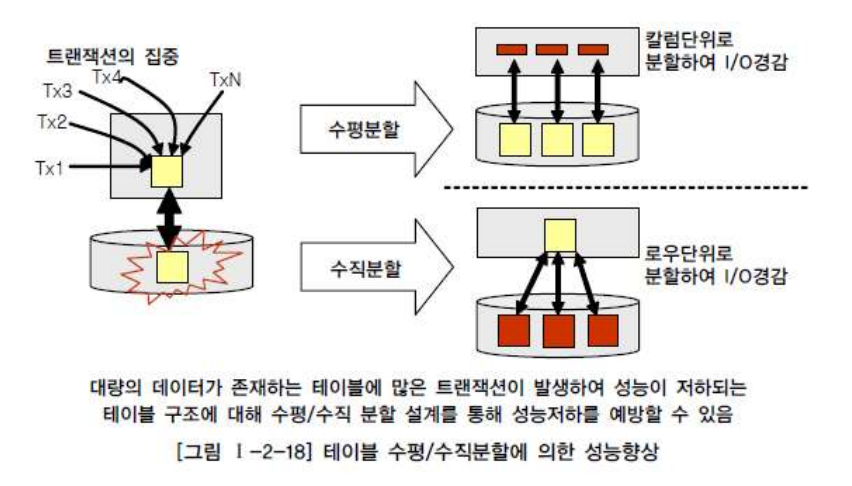

# Subject : UnderStanding of Data Modeling

Contents
---

[Chapter 1. 데이터 모델의 이해](#데이터-모델의-이해)
1. [데이터 모델의 이해](#데이터-모델의-이해)
2. [엔티티](#엔티티)
3. [속성](#속성)
4. [관계](#관계)
5. [식별자](#식별자)

 [Chapter 2. 데이터 모델과 성능](#데이터-모델과-성능)

1. [성능 데이터 모델링의 개요](#성능-데이터-모델링의-개요)
2. [정규화와 성능](#정규화와-성능)
3. [반정규화와 성능](#반정규화와-성능)
4. [대량 데이터에 따른 성능](#대량-데이터에-따른-성능)
5. [데이터베이스 구조와 성능](#데이터베이스-구조와-성능)
6. [분산 데이터베이스와 성능](#분산-데이터베이스와-성능)

 

---
 

## 데이터 모델의 이해
 

### 데이터 모델의 이해

 
1. 데이터 모델링 정의

    현실 세계를 데이터베이스에서 표현하기 위한 **추상화 과정**이다.
    **데이터 모델링 표기법**을 사용하여 모델링한다.
    업무 프로세스 내 비즈니스 프로세스 규칙(BR)을 정의, 간결하게 데이터 모델로 표현.

_기능_ 

_시스템 가시화, 시스템 구조와 행동을 명세화, 시스템 구축하는 구조화된 틀 제공, 시스템 구축과정 문서화 어쩌고 저쩌고_

_중요해 왜 ? why_

    파급효과 
    DB구축하고, 시스템, 애플리케이션 다 만들고 병행, 통합 테스트하다...어라라 이게 왠걸 데이터 구조를 고쳐야 하네??????

    간결한 표현
    건출물의 설계 도면 처럼, 표준 공유를 통해 데이터 모델 파악. 데이터 정합성을 유지하게 해줌.

    데이터 품질
    중복, 비유연성, 비일관성 <- 적폐임 ㅇㅇ

 d 
 d 

 
2. 데이터 모델링의 특징
  

**추상화(Abstraction)** : 현실 세계를 일정한 표기법에 맞게 표현

**단순화(Simplification)** : 이해하기 쉽게 약속된 표기 및 언어로 표현

**명확화(Clarity)** : 의미가 한 가지로 정확하게 해석되게 기술

 

3. 데이터 모델링의 단계

- 개념적 모델링

    가장 추상적, 업무 파악용, 핵심 엔티티 도출, ERD 작성

    데이터 요구사항 발견가능하다, 현 시스템의 변형 방향을 이해한다...? 

- 논리적 모델링

    DB 설계 프로세스 input임. 비즈니스 정보의 논리적 구조와 규칙을 명확하게 표현

    어떤 데이터베이스 모델을 사용할지, [세부속성, 식별자, 관계] 정의, 데이터 정규화 완료, 재사용성이 높다..

- 물리적 모델링

    물리적 성능과 데이터, 저장을 고려한 설계. 어떻게 하드웨어에 표현될 것인가...
    가장 객관적...
    성능, 보안, 가용성을 고려한 데이터베이스 모델링

(EA 기반의 전사적인 데이터 모델링 전개할 때에는 상위수준 개괄적 데이터 모델링 이후, 업무영역에 따른 개념적 데이터 모델링) - 참고 하라고

  
4. 데이터 모델링의 3가지 관점
 
- 데이터 관점 

    데이터와 데이터/업무간 관계에 따라 모델링. 비즈니스 프로세스에서 사용되는 데이터 의미.
    **구조분석, 정적분석**

- 프로세스 관점

    업무에 따라 모델링, 비즈니스 프로세스에서 수행하는 작업을 의미.
    **시나리오 분석, 도메인 분석, 동적 분석**

- 데이터와 프로세스의 상관 관점 (실무)

    업무 프로세스와 데이터 간의 서로 어떤 영향을 주고 받는지를 모델링. 프로세스와 데이터 간의 관계를 의미
    
    :star:CRUD(Create, Read, Update, Delete) :star:

  
5. 데이터 모델링을 위한 ERD (Entity Relationship Diagram)
 

1976 피터 첸이 만든 표기법. 현재도 데이터 모델링의 표준.

ex) **Chen, IE, Barker**, UML

- ERD 작성 순서

    엔티티 도출, 배치, 관계 설정,

    관계명 기술, 관계 참여도 기술, 관계 필수 여부 기술

  
6. 3 단계 구조 스키마 (3-Level Schema)
 

데이터 베이스의 독립성을 위해 3단계 구조 스키마가 존재한다.

    * 사용자(외부 스키마)
        데이터베이스 개별 사용자 관점의 이해와 표현.
        응용프로그램이 접근하는 데이터베이스
        여러개의 외부 스키마 존재

    * 설계자(내부 스키마)
        데이터베이스 관리자의 관점으로 저장 장치 관점의 이해 및 표현. 저장 위치 및 실질적인 관리.
:star:
    * 개발자(개념 스키마) :star:    
        
        데이터베이스 관리자의 관점으로 규칙과 구조 표현
        데이터베이스의 전체적인 논리구조
        일반적으로 스키마는 개념 스키마를 지칭

각 관점에 따라 데이터베이트 기술, 이들의 관계를 ANSI 표준으로 정함. 각 계층을 **뷰**라고 부르며, 3단계 계층으로 분리되어 서로 독립성을 확보함.

데이터의 독립성 확보를 통해...

    -> 데이터 복잡도 감소
    -> 데이터 중복 제고
    -> 사용자 요구사항 변경에 따른 대응력 향상
    -> 관리 및 유지보수 비용 절감

### 엔티티

- 저장되고 관리되는 데이터의 집합
- 개념, 사건, 장소, 등의 명사
- 유형과 무형에 따른 분류
- 식별자에 의해 식별이 가능해야된다. 속성이 있어야 된다.
- 인스턴스 : record, 실제 데이터. 엔티티는 인스턴스의 집합
- 프로세스에 이용되야함. 제거하거나, 누락된 프로세스를 찾거나

난 뭐지 같은 소리 하고 있네.

- 다른 엔티티와 최소 하나 이상의 *관계* 를 가져야함.....

- 유무형에 따른 분류

    유형 엔티티: 물리적, 안정적(불변), 지속적인 엔티티.
    ex) 사원, 제품, 교수...

    개념 엔티티: 개념적으로 존재, 정보로 구분
    ex) 강의, 금융상품, 부서...

    사건 엔티티: 비즈니스 프로세스에 따라 **발생**. 데이터가 많다.
    ex) 구매, 판매, 영업, 수납...

- 발생 시점에 따른 엔티티 분류

    기본 엔티티: 키 엔티티라고 하며, 독립적으로 생성 및 관리.
    ex) 고객, 부서, 판매 제품...

    중심 엔티티: 기본 엔티티로부터 발생, 행위 엔티티를 생성하는 중간 엔티티.
    ex) 계좌, 주문, 수납 ...

    행위 엔티티: 상위에 있는 2개 이상의 엔티티로 부터 발생되는 엔티티.
    ex) 주문 이력, 접속 이력, 수납 이력...
    
### 속성

- 엔티티는 두 개 이상의 인스턴스, 두 개 이상의 속성정보를 갖는다...

- 엔티티가 가지는 항목으로 더 이상 분리 되지 않는다.

- 업무에 필요한 데이터를 저장 한다.

- 인스턴스의 구성 요소로 최소의 데이터 단위.

- 속성의 특징
    * 속성은 업무에서 관리되는 정보
    * 속성은 하나의 값만 가진다.
    * 주식별자에게 함수적으로 종속된다. 기본키에 따라 속성의 값도 변경 될 수 있다.

- 특성에 따른 속성의 종류
    * 기본 속성: 비즈니스 프로세스에서 도출된 본래의 속성(불변)
    ex) 이름, id, 전화번호...

    * 설계 속성: **데이터 모델링 과정**에서 발생되는 속성
    ex) 상품코드, 지점코드...

    * 파생 속성: 다른 속성에 의해서 만들어지는 속성, 정합성을 위해 적은게 좋다.
    ex) 합계, 평균...

### 관계

- 엔티티와 인스턴스 사이의 논리적인 연관성

- 엔티티 안에 인스턴스가 개별적으로 관계를 가지는 것이 관계 페어링, 이들의 집합이 **관계**

- 관계의 분류

    * 존재에 의한 관계: 위와 같이 존재 형태에 따라 관계가 형성되어 있다.

    * 행위에 의한 관계: 특정 행위에 의해 생성된 인스턴스 와의 관계이다.

연관 관계, 의존 관계...

- 관계의 표기법

    * 관계명: 관계의 이름, 현재형으로 명확하게 존재하는 상태를 표기해야한다.

    * 관계 차수: 1:1, 1:M, M:N, 다수면 까마귀발이 붙는다.
    
    * 관계 선택사양: 필수/선택, 선택참여하는 엔티티쪽을 원으로 표시한다.

    4 명의 손님이 들어와서 1, 2명만 주문을 한다. 주문은 손님이 해야하지만, 손님은 주문을 선택 할 수 있다. 이때 주문에 원이 달림.

### 식별자

- 엔티티는 인스턴스 집합이다. 각각의 인스턴스를 구분할 수 있어야한다.

- 주 식별자에 의해 엔티티내에 모든 인스턴스들이 유일하게 구분되어야 한다.

- 주식별자를 구성하는 속성의 수는 유일성을 만족하는 최소의 수가 되어야 한다.
말 드럽네.

- 불변값이어야 하고, 주식별자가 지정되면 값이 들어와야함. 사원은 안들어왔는데, 사원번호만 생김 폰사원 ㄷㄷ

유일성, 최소성, 불변성, 존재성

- 다음 구분에 따라 식별자를 구분한다.

- 식별자 표기법은 다음과 같다.

- 주식별자 도출 기준

    업무에서 자주 이용되는 속성으로 지정
    명칭, 내역 등과 같이 이름으로 기술되는 것들을 가능하면 지정하지 않는다. -> 다른 엔티티와 겹칠 수 있다.
    복합으로 주식별자 구성시 많은 속성이 포함되는것을 피해야됨.

- 외부식별자는 다른 엔티티와의 관계를 통해 자식 엔티티에 생성되는 속성이다.

    자식 엔티티는 외부 식별자를 주식별자로 이용할 것인지 선택해야 된다.
    사용할 경우 식별자관계라고하고, 즉당히 일반 속서응로 사용하는 경우 비식별자 관계라고 한다.

 

---
## 데이터 모델과 성능
 

### 성능 데이터 모델링의 개요

1. 성능 데이터 모델링의 정의

일반적인 실무 프로젝트에서 애플리케이션 성능 저하의 경우, 개발자가 SQL구문을 잘못 구성한 경우도 있지만, 근본적으로 디자인이 잘못되어있는 경우가 있다.

데이터 모델 구조, 대용량 데이터, 인덱스 특성 이 세 가지를 고려하면 성능 향상이 가능하다.

일반적인 성능은 데이터 **조희**의 성능. 입력, 수정, 삭제는 일시적임. 

- 성능 데이터베이스 모델링이란
    
    설계단계의 데이터 모델링 때부터 정규화, 반정규화, 테이블통합, 테이블분할, 조인구조, PK, FK, 등 여러가지  성능과 관련된 사항이 데이터 모델링에 반영될 수 있도록 하는 것. 

2. 성능 데이터 모델링 수행시점

성능 향상을 위한 비용은 사전에 할수록 비용이 들지 않는다. 
  분석/설계 단계  에서 성능을 고려한 데이터 모델링을 수행할 경우 성능 저하에 따른 Rework 비용을 최소화 할 수 있다.
    + sql튜닝이 마법이 아니다.

3. 성능 데이터 모델링 고려사항

    * 데이터 모델링을 할 때 정규화를 정확하게 수행
    * 데이터베이스 용량산정을 수행
    * 데이터베이스에 발생되는 트랜잭션의 유형 파악
    * 용량과 트랜잭션의 유형에 따라 반정규화를 수행
    * 이력모델의 조정, PK/Fk조정, 슈퍼/서브 타입 조정 수행
    * 성능관점에서 데이터 모델 검증

정규화된 모델은 데이터를 주요 관심사 별로 분산시키는 효과가 있다. 정규화가 완성된 모델의 각각 엔티티에 어느정도 트랜잭션이 들어오는지 용량산정을 하여 엔티티별로 데이터가 대용량인지 구분할 수 있게 해준다.
테이블에 데이터가 어떻게 처리되는지 트랜잭션 유형을 파악하면 SQL 문장의 조인관계 테이블에서 데이터조회의 칼럼들을 파악할 수 있게 된다. 

    * 트랜잭션 파악은 CRUD 메트릭스, 객체지향 모델의 시퀀스 다이어그램 어쩌고....

이렇게 파악된 용량산정과 트랜잭션의 유형데이터를 근거로 정확하게 테이블에 대해 반 정규화를 적용. 이후 성능 관점에서 데이터 모델 검토를 실시.

 

### 정규화와 성능
 

이 빌어먹을 책은 정규화가 뭔지 설명을 하지도 않고 정규화의 성능을 운운한다.

- 정규화: 중복을 최소화하게 데이터를 구조화하는 프로세스. 정규화의 기본 목표는 관련이 없는 함수 종속성은 별개의 릴레이션으로 표현하는 것. 정규화된 결과를 정규형이라고 하며, 1 ~ 5 정규형이 존재. 

정규화 수행시 엔티티가 발생하고, SQL문에서 조인이 많이 발생하여 이로 인한 성능 저하가 나타나는 경우가 있다. 

데이터처리의 성능은 조회 성능 - 입력/수정/삭제 성능 으로 구분할 수 있으며, 데이터 모델을 구성하는 방식에 따라 두 성능이 Trade-Off  이다.

일반적으로 정규화가 잘 되어 있으면 입력/수정/삭제의 처리 성능이 향상된다. 단, 데이터를 조회할 때에는 조회 성능이 향상될 수도 있고 저하될 수도 있다.

    -> 반정규화를 해도 조회 성능이 향상 되지 않을 수 있다.

반정규화된 테이블의 조회 성능 저하 사례

    1. PK Unique Index 활용으로 정규화시 조인 성능 저하 미비

    정확히는 PK = Unique Index + Not Null을 의미

    조회시 정규화된 두 테이블을 join하여 처리할 때, Unique Index를 곧바로 찾아서 데이터 조회하기 때문에, 성능 차이가 미비하다. 특정 조건을 만족하는 조회를 할 때에는 필요한 Index만 조회하기 때문에 정규화된 경우가 조회 성능이 더 좋을 수가 있다.

    2. 2차 정규화를 통해 특정 속성에 종속된 속성들을 따로 테이블로 만들고 조회. 중복조희를 줄일 수 있다... 

    3... 등등..

- 함수적 종속성(Functional Dependency)에 근거한 정규화 수행 필요

데이터들이 어떤 기준값에 의해 종속되는 현상을 지칭

기준값을 결정자(Determinant)라 하고 종속되는 값을 종속자(Dependent)라고 한다.
예를 들면, 이름, 출생지, 전화번호 등은 주민등록번호 속성에 종속된다.

함수의 종속성을 이용하여 정규화 작업이나 각 오브젝트에 속성을 배치하는 작업을 한다. 

 

### 반정규화와 성능
 

반정규화는 정규화의 반대의미를 가진다.
협의로는 데이터를 중복하여 성능을 향상시키기위한 기법, 광의로는 성능을 향상시키기 위해 정규화된 데이터 모델에서 중복, 통합, 분리 등을 수행하는 모든 과정을 의미한다.

_효과_ -> 시스템 성능 향상, 개발과 운영의 단순화

_언제?_ -> 디스크 I/O량에 따른 성능 저하, 경로가 멀어 조인으로 인한 성능저하 ...

정규화를 수행하면 입력/수정/삭제에 대한 성능 향상만 아니라 조회에 대해서고 성능을 향상시키지만, 엔티티의 갯수가 증가하고 관계가 많아져 여러개의 조인이 걸려야 데이터를 조회할 수 있는 경우가 있다.

 보통은 SQL문을 단순하게 하고싶어서 칼럼의 반정규화 유형이 많으나, 테이블의 반정규화, 관계의 반정규화를 종합적으로 고려하여 적용해야 한다. 

- 반정규화 절차

    * 반정규화 대상 조사
    * 다른 방법유도 검토
    * 반정규화 적용

- 반정규화 기법

    - 테이블 반정규화
     

    - 칼럼 반정규화
    

    - 관계 반정규화

    데이터를 처리하기 위한 여러 경로를 거쳐 조인이 가능하지만 이 때 발생할 수 있는 성능저하를 예방하기 위해 추가적인 관계를 맺는 방법이 관계의 반정규화임
    
조회할 속성이 제각각 다른 엔티티에 포함되어 있을 경우, 여러 엔티티를 조인하여 SQL문을 작성하여아한다. -> 반정규화시 간단하게 호출가능.

데이터베이스 서버가 분산되어 있을때, 특정 서버에서 호출되는 속성이 다른 서버에서 빈번하게 조회될 때, 조인의 성능저하가 발생한다. -> 반정규화시 조회 성능 향상 시킬 수 있다. (DB Link 조인이 발생하지 않음.)

 

### 대량 데이터에 따른 성능

대량 데이터발생시 트랜잭션 분산이되어 있지 않은경우 디스크 I/O 유발로 성능 저하가 발생할 수 있다. (클라우드 환경이라면 network bendwidth?)
트랜잭션이 분산 처리될 수 있도록 테이블단위에서 분할 적용을 검토해야함.

하나의 테이블에 대량의 데이터가 존재하는 경우에는 인덱스의 Tree 구조가 너무 커져 효율성이 떨어져 데이터를 처리(CRUD)할 때 디스크 I/O를 많이 유발하게 됨.

트리구조?!?! -> B-tree, B+tree

로그 시간이지만, depth가 깊어지면 디스크 I/O가 발생하나 보다.... pointer가 더 필요한 문제인가?

로우(데이터, 레코드)가 많아지면, depth가 늘어나고, 칼럼(속성)이 많아지면, 물리적인 디스크에 여러 블록 데이터가 저장되게 된다. 

- 테이블에 칼럼이 많은 경우 성능

-> 칼럼이 많아지면 데이터를 처리할 때 여러블록에서 데이터를 I/O해야 하는 즉 SQL문장의 성능이 저하될 수 있다....

칼럼이 길면, 

    - 데이터 블록 하나에 데이터가 모두 저장되지 않고 두 개 이상의   블록에 걸쳐 하나의 로우가 저장되는 *로우 체이닝*

    - 데이터 블록에서 수정시 해당 블록에 저장안되고 다른 블록의 빈 공간에 저장되는 *로우 마이그레이션*

이 많아지고, 이는 디스크 I/O의 과다로 이어진다.

뭐만 하면 그냥 디스크 I/O.... 이게뭐노..?

- 대량 데이터 저장 및 처리로 인한 성능.

파티셔닝... 드디어 나왔다!

    1. RANGE PARTITION 
    날짜 -> 연 + 월을 이용해 12개의 파티션을 만들어 테이블 구분.
    -> 테이터보관 주기에 따른 테이블관리가 용이하다. 

    2. LIST PARTITION
    지점, 사업소, 사업장, 등 핵심적인 코드값으로 PK구성시 값을 기준으로 파티셔닝 가능하다.

    3. HASH PARTITION
    지정된 HASH 조건에 따라 테이블이 분리되며, 설계자는 테이블에 데이터가 어떻게 들어갔는지 몰?루 (대충 HASH 함수 돌려서 파티셔닝하는듯?)

  

### 데이터베이스 구조와 성능

1. 슈퍼타입/서브타입 모델의 성능고려 방법

 

### 분산 데이터베이스와 성능

분산 데이터베이스의 투명성

    * 분할 투명성
    * 위치 투명성
    * 지역사상 투명성
    * 중복 투명성
    * 장애 투명성
    * 병행 투명성

부분 복제와 광역 복제를 통해 Falut Tolerance를 보장한다....
